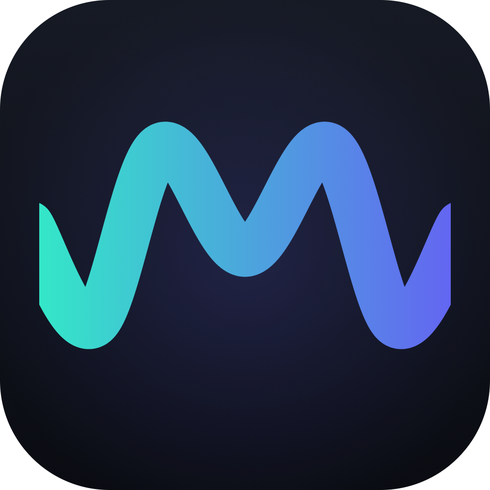

  

  # Murmur

  **Private, native-Swift speech-to-text for macOS.**

  Dictate into any app, capture meetings, and transcribe audio files, all on-device. Nothing is sent to the cloud.

---

## What it does

Murmur turns speech into text entirely on your Mac. Hold a key and talk, and what you say is typed at your cursor in whatever app you are using. It can also record meetings into clean, speaker-labelled transcripts and transcribe audio files you drop in. Keep it in the menu bar, the Dock, or both; a full window holds your history and settings.

## Why I built it

I kept reaching for speech-to-text because talking is a more natural way to communicate, and to think, than typing. It quickly became how I worked with AI agents every day. But the tools I tried each fell short. One showed the words as they appeared, so if it stumbled or cut off I could carry on from where it left off, yet the transcription itself was mediocre. Another had a great model but hid the text while it formed, so a crash in the middle meant the whole message was simply gone. The polished apps that got both right sat behind paywalls that were hard to justify when the speech model is free and the app is simple to build.

So Murmur is built around one rule above all: your recording is always saved, even if something crashes. Around that sits a strong on-device model, no paywall, and nothing ever leaving your Mac.

## Features

- **Dictation anywhere:** hold a key, speak, and the text is typed at your cursor. Four interaction modes, a configurable hotkey, and your clipboard is preserved.
- **Mutes background audio** (Spotify, Music) while you talk and restores it after. Calls in a browser or an app like Zoom are left alone.
- **Meeting capture:** records your mic and the system audio as two tracks, with speaker labels merged into one chronological transcript.
- **File import:** drop in a voice memo or recording to transcribe it.
- **Never loses a recording:** audio streams to disk continuously and is recovered after a crash.
- **History and housekeeping:** searchable history, soft delete with a 30-day Recently Deleted, and auto-delete of old recordings.
- **Optional on-device AI:** a one-line summary and stutter cleanup per transcript.

## Speech engine and privacy

Murmur uses NVIDIA Parakeet TDT v3 via [FluidAudio](https://github.com/FluidInference/FluidAudio) on the Apple Neural Engine, covering German, English, Dutch, and 22 other European languages with automatic language detection. Everything runs on-device; the only network access is a one-time model download. The optional AI features use Apple's on-device Foundation Models.

## Requirements

- Apple Silicon Mac, macOS 15 or later.
- The optional AI summary and cleanup need macOS 26 (skipped automatically otherwise).

## Download

[**Download the latest release**](https://github.com/Fluitketel0/murmur/releases/latest), unzip it, and drag Murmur into your Applications folder. It updates itself automatically from then on.

Murmur is not notarized (it is a free personal project with no paid Apple Developer account), so the first time you open it macOS warns that it is from an unidentified developer. Right-click the app and choose Open, or go to System Settings > Privacy & Security and click Open Anyway.

The first time you enable dictation or record a meeting, macOS asks for the relevant permission (Accessibility, microphone, or system audio). Grant it and you are set.

## For developers

Building from source, the design, and the roadmap are documented in [ARCHITECTURE.md](ARCHITECTURE.md) and [PLAN.md](PLAN.md).

A personal project, under active development.
